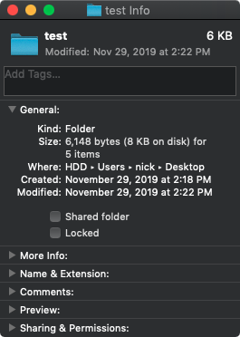
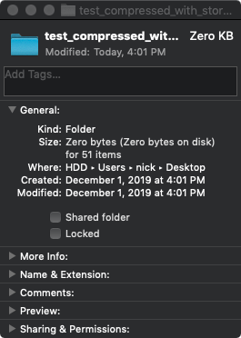

# Storage Space Creator 📂💫😎

Create more storage space for your personal computer.

 * [About](#about)
 * [Installation](#installation)
 * [Usage: Console](#usage-console)
 * [Usage: API](#usage-api)
 * [Frequently Asked Questions](#frequently-asked-questions)
 * [TODO](#todo)
 * [Authors](#authors)
 * [License](#license)

## About

Storage Space Creator 📂💫😎 uses an innovative compression pattern to achieve a perfect 100% compression ratio. Using Storage Space Creator 📂💫😎, we can achieve infinite storage on exactly every storage volume in existence. Also, P=NP.

Before compression:



After compression:



Storage Space Creator 📂💫😎 uses an innovative emoji system for displaying errors and indexing files. If you don't like emojis, find another solution for creating storage space 😡

⚠️ Please read the [FAQ's](#frequently-asked-questions) for more information ⚠️

## Installation

This package requires Node.js.

Install via npm to integrate with your node package:
```
$ npm i nickvirag/DownloadMoreStorageSpace
```

Or clone the repository directly:
```
$ git clone https://github.com/nickvirag/DownloadMoreStorageSpace.git
```

## Usage: Console

Storage Space Creator 📂💫😎 can be run directly from the console.

Supported args:

* -h, --help: Show help information
* -c, --compress: Compress input filepath
* -e, --expand: Expand input filepath
* -i=, --input=: Input filepath
* -o=, --output=: Output filepath
* -r, --replace: Overwrite output if exists

Example usage:
```
# Compress an input directory or file to the default output (path/to/input_compressed)
$ npm run main -- path/to/input -c

# Compress an input directory or file to a specific output
$ npm run main -- path/to/input path/to/output -c

# Expand an input directory to a specific output
$ npm run main -- -i=path/to/input -o=path/to/output -e
```

## Usage: API

Storage Space Creator 📂💫😎 can be integrated with your own Node.js package.

Four methods are provided. Detailed error reporting is available further below.

```
const {
  compress,
  expand,
  bufferToFilepaths,
  filepathsToBuffer,
  errorMessages,
} = require('storage-space-creator');
```

### compress()
```
async function compress(sourcePath, destinationPath, options={ shouldOverwriteOutput: false })
```
Compress a source using the Storage Space Creator 📂💫😎 compression algorithm.

Example:
```
await compress(
  'path/to/input',
  'path/to/output',
  { shouldOverwriteOutput: true },
);
```

### expand()
```
async function expand(sourcePath, destinationPath, options={ shouldOverwriteOutput: false })
```
Expand a source that has been compressed using the Storage Space Creator 📂💫😎 compression algorithm.

Example:
```
await expand(
  'path/to/input',
  'path/to/output',
  { shouldOverwriteOutput: true },
);
```

### bufferToFilepaths()
```
function bufferToFilepaths(buffer)
```
Convert a buffer to a list of filepaths that will be created by Storage Space Creator 📂💫😎. Unlike `compress`, this does not create an output file on the user's hard drive.

Example:
```
const buffer = Buffer.from(...);
const filepaths = await bufferToFilepaths(buffer);
```

### filepathsToBuffer()
```
function filepathsToBuffer(buffer)
```
Convert a list of filepaths that have been defined by Storage Space Creator 📂💫😎's `bufferToFilepaths` or `compress` methods into a buffer. Unlike `expand`, this does not create an output file on the user's hard drive.

Example:
```
const filepaths = [...];
const buffer = await filepathsToBuffer(filepaths);
```

### errorMessages

Error messages are transcoded to emoji.

Here is a list of possible error messages:

* 🤫
* 🤔
* 🤲
* 🤯
* 🙅‍♀️

These emoji are sufficiently self-descriptive, so no further error message documentation is necessary.

## TODO

- [ ] Create automated tests for file/directory compression and extraction
- [ ] Improve error handling when file conflicts arise due to `--replace`/`shouldOverwriteOutput` configuration
- [ ] Support console usage when globally installing the package, e.g. `npm i nickvirag/DownloadMoreStorageSpace -g`
- [ ] Improve error handling to capture more cases and implement a graceful fallback for unknown errors
- [ ] Switch from buffers to streams to support large files and directories

## Frequently Asked Questions

### How does it work?
macOS doesn't include filenames when calculating folder size, so we can create an "empty" folder full of data by creating empty files and encoding data in the filenames.

### Why did you do this?
I don't know. I'm sorry.

### Does this work on Windows?
I have a Windows computer, but I've decided not to test this code on it.

### What's the largest filesize that this supports?
This loads the entire file or directory into memory when encoding and decoding, so it probably doesn't support very big files.

## Authors

Nick Virag - nick@nickv.co

## License

This project is licensed under the MIT License - see [LICENSE.md](LICENSE.md) for details
